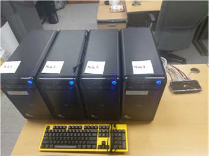
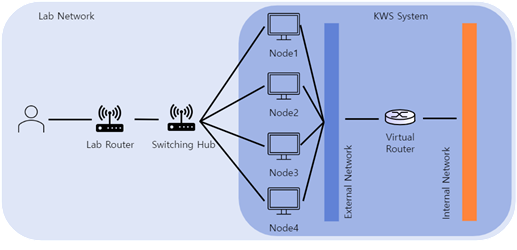
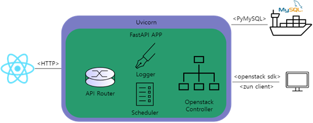
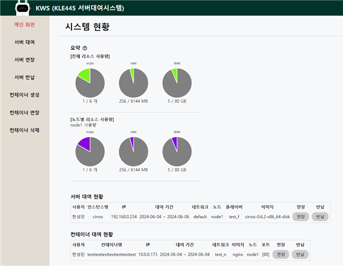
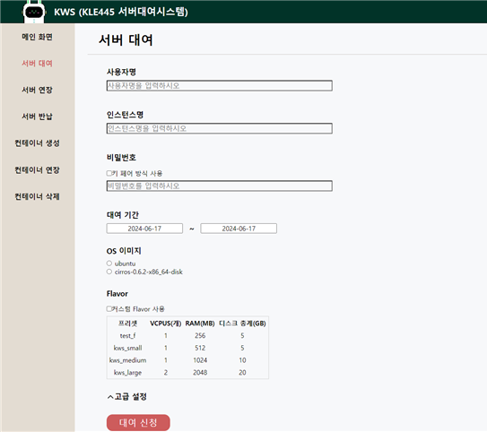
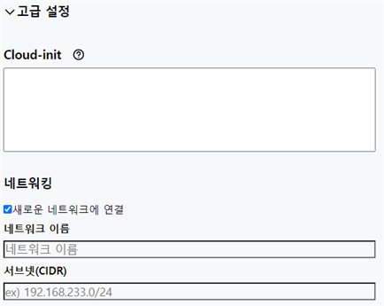
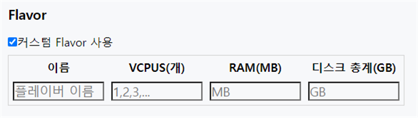
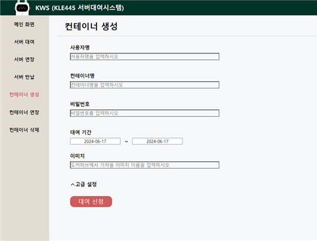

# KWS
## 개요
### 시스템의 목표
본 프로젝트는 연구실의 학생들이 서버를 운용하기 위한 클라우드 플랫폼을 구축하는 것을 목표로 합니다. 
당시 학과에서 운용 중인 서버 대여 시스템은 딥러닝용 서버로, 높은 컴퓨팅 자원을 요구하는 작업에 적합했습니다. 
반면 웹 서버와 같이 상대적으로 컴퓨팅 자원이 많이 필요하지 않는 프로그램을 구동하는 경우에는 학과 서버 대여 시스템을 이용 시 리소스 측면에서 낭비가 발생할 수 있어 이용을 꺼리게 되는 경향이 있었습니다. 
그에 따라 간단한 서버 용도로 PC를 대여하려는 학생들의 요구가 증가하고 있는 상태였습니다.

사용자뿐만 아니라 관리자 측면에서도 대여하는 서버를 수동으로 할당하고 초기화해야하는 불편함이 존재했고, 이에 따른 여러 문제점도 제기되고 있었습니다. 

이에 따라, 연구실 내부망에서 웹 서버와 같이 상대적으로 작업량이 적은 서버 운용을 위한 클라우드 플랫폼을 개발하여 사용자의 요구를 충족시키고, 관리의 효율성을 높이고자 하여 KWS 프로젝트를 시작했습니다.

### 주요 기능
소프트웨어가 제공하는 주요 기능은 다음과 같습니다.

- 사용자
  - 외부에서 접속할 수 있는 서버, 컨테이너를 대여 및 반납할 수 있다.
  - 서버의 대여 현황을 조회할 수 있다.
- 관리자
  - 모든 사용자의 대여 현황을 조회할 수 있다.
  - 서버의 생성에 사용되는 이미지를 관리할 수 있다.

## 기여 내용
### 인프라 구축


당시 학과에서 사용하지 않던 물리 컴퓨터 4대를 이용하여 프로젝트의 인프라를 구축하였습니다.
해당 컴퓨터들의 사양은 아래와 같습니다.

| 부품 | 사양 |
| -- | -- |
| CPU | Intel Core I7 6700 3.4GHz |
| 주기억장치 | 8GB |
| 보조기억장치 | SSD(128GB), HDD(500GB) | 
| 그래픽카드 | NVIDIA GT730 |
| OS | Ubuntu 22.04 |

스위칭 허브를 통해 연구실 네트워크 환경에 연결하고 모든 컴퓨터들을 연결해주었습니다. 아래는 네트워크 시점에서의 배치 상태입니다.



각각의 노드들은 KWS 시스템의 외부 네트워크로 개방되어 있으며 외부 네트워크는 OpenStack 내부의 가상 라우터를 통해 내부 네트워크와 연결됩니다.

### OpenStack 시스템 구축
각 컴퓨터들에 OpenStack을 설치하고 통합하여 자원을 프로비저닝할 수 있게 하였습니다.

OpenStack의 구축에는 DevStack을 사용하였습니다.

오픈스택에서 제시하는 기본적인 멀티노드 시스템의 구축 방법은 컨트롤러 노드와 컴퓨트 노드로 나뉘어져 하나의 컨트롤러 노드가 있고 복수의 컴퓨트 노드가 있는 아키텍처입니다. 
이때 컨트롤러 노드는 하이퍼바이저의 역할을 수행하지 않고 사용자의 요청을 기반으로 컴퓨트 노드에게 명령을 내립니다. 
컴퓨트 노드는 컨트롤러의 명령을 수행하여 네트워크를 할당하거나 자원을 프로비저닝 하는 역할을 맡습니다.

KWS를 구축할 때는 기존의 방식이 아닌 독자적인 멀티노드 아키텍처를 구축하였습니다. 모든 노드를 단일 노드로 구축한 뒤 서버 측에서 노드들을 제어하는 방법으로,
현재 시스템과 같이 가용 가능한 컴퓨트 노드의 개수가 적을 때 특히 효과적인 방법으로, 모든 노드의 자원을 프로비저닝할 수 있습니다.

시스템의 제어를 서버측에서 구현하므로 다양한 방법으로 요청과 동작 구조를 제어할 수 있으며 단일 노드의 구축이 멀티 노드의 구축보다 훨씬 쉽기 때문에 구축 난이도 또한 내려가는 장점이 있습니다.

### 백엔드 서버 개발


OpenStack의 SDK가 파이썬으로 작성되어 있었기 때문에 이를 적극 활용하려는 의도로 백엔드는 Python과 FastAPI를 이용하여 구축하였습니다.

백엔드 서버는 클라이언트의 HTTP 요청을 수신하여 OpenStack 커넥션을 통해 특정한 작업을 수행한 뒤 응답을 반환합니다.

매일 0시 0분에 스케줄러가 동작하여 대여 기간이 지난 VM과 컨테이너들을 삭제합니다.

```python
# 커스텀 커넥션 객체
class Connection:
    def __init__(self, auth_url):
        self.connection = openstack.connect(auth_url=auth_url,
                                            username=openstack_config['username'],
                                            password=openstack_config['password'],
                                            project_name=openstack_config['project_name'],
                                            domain_name=openstack_config['domain_name'])
        self.zun_connection = client.Client(1,
                                            auth_url=auth_url,
                                            username=openstack_config['username'],
                                            password=openstack_config['password'],
                                            project_name=openstack_config['project_name'],
                                            user_domain_name=openstack_config['domain_name'],
                                            project_domain_name=openstack_config['domain_name'])
```

시스템에서 VM 기능 뿐만 아니라 컨테이너 기능까지 같이 사용하고 있고 각 기능에서 사용하는 SDK가 달랐기 때문에 이를 묶는 커스텀 커넥션 객체를 구현하였습니다.

스프링에서 Bean이 Map으로 관리되듯, KWS에서의 커넥션도 딕셔너리로 관리하도록 하였습니다.

해당 커넥션을 이용하여 특정한 노드를 제어할 수 있고, 백엔드 서버에서 이를 이용하여 특정 노드의 작업을 수행합니다.


### OpenStack Controller 구현
VM 기능을 사용할 때는 OpenStack SDK, 컨테이너 기능을 사용할 때는 Zun Client를 사용해야 합니다. 유지보수 측면에서 보았을 때 둘 모두 OpenStack을 이용하는 기능이라고 생각하여 하나의 게이트웨이를 통해 이용하는 편이 좋을 것이라고 생각하였습니다.

또한 SDK의 몇몇 함수의 자동완성이 지원되지 않는 문제, kwargs에 들어갈 내용을 식별하기 어렵다는 문제, 특정 함수에서는 인자로 이름을 넘겨주면 되지만 특정 함수에서는 이름이 아닌 id를 넘겨줘야 하는 등 개발자 입장에서 불편한 요소가 많았습니다.

따라서 이러한 불편함을 개선하는 자체 미들웨어를 개발하는 것이 좋겠다고 판단하여 OpenStack Controller를 구현하였습니다.
OpenStack Controller에는 IDE의 자동완성을 완벽히 지원하며 docstring을 통해 개발자가 명확히 이 함수가 어떤 일을 수행하는지 알 수 있도록 했습니다.

단일 유스케이스에서도 SDK의 다양한 함수를 실행해야하는 경우가 많았기 때문에 파사드 패턴을 사용하여 고수준 인터페이스로 통합했습니다. 개발자는 내부적으로 어떤 순서에 따라 어떤 함수를 실행해야하는지 알 필요 없이 OpenStack Controller의 단일 함수만 호출하면 되도록 하였습니다.

이 컨트롤러를 통해 KWS 백엔드 시스템은 각 노드들의 커넥션을 관리합니다.

```python
    def get_connections(self, logger_on: bool = True) -> dict[str, Connection]:
        """
        어댑터 클래스 내부 Connection 객체를 반환합니다.
        Openstack SDK에 직접 접근할 필요가 있을 때 사용합니다.
        Openstack SDK의 자세한 내용은 아래 문서를 참고하세요.
        https://docs.openstack.org/openstacksdk/rocky/user/index.html#api-documentation

        오픈스택 컨트롤러는 내부에서 노드들의 커넥션을 딕셔너리로 관리합니다.
        {'노드명': '커넥션 객체'}로 저장되어 노드명으로 접근하면 됩니다.
        커넥션 객체 내부는 nova, neutron 등 오픈스택의 기본 모듈에 접근하기 위한
        오픈스택 커넥션(connection)과 컨테이너를 담당하는 zun에 접근하기 위한
        준 커넥션(zun_connection)이 존재합니다.

        :return: dict[str, Connection]
        """
        if logger_on:
            self._logger.info(f'get_connections 실행')
        return self._connections
```

다만 혹시나 직접적인 커넥션의 접근이 필요할 때가 있을 것이라 생각하여 실제 커넥션을 반환하는 함수를 작성해두었습니다.

컨트롤러에 작성된 함수의 예시 코드는 아래와 같습니다.

```python
# 서버 대여 코드
    def create_server(self,
                      server_name: str,
                      image_name: str,
                      flavor_name: str,
                      network_name: str,
                      password: str,
                      cloud_init: str,
                      node_name: str,
                      logger_on: bool = True) -> openstack.compute.v2.server.Server:
      # 다른 작업자가 보았을 때 이 함수가 어떤 역할을 하는지 명확히 알 수 있도록 함수마다 docstring을 작성했습니다.
         """
        UC-0101 서버 대여 / UC-0202 인스턴스 생성
        서버 정보를 바탕으로 인스턴스를 생성합니다.
        password가 입력된 경우 password로 접속이 가능하도록 설정하며,
        그게 아닌 경우 키페어를 할당합니다.

        :param server_name: 생성할 서버의 이름
        :param image_name: 생성할 서버의 이미지 이름
        :param flavor_name: 생성할 서버의 플레이버 이름
        :param network_name: 생성할 서버의 네트워크 이름
        :param password: 생성할 서버의 비밀번호 None일 경우 키페어 자동 할당
        :param cloud_init: 생성할 서버에 적용할 cloud-init
        :param node_name: 접근할 노드명
        :param logger_on: 로그 온/오프
        :return: 서버 객체
        """
        if logger_on:
            self._logger.info(f'[{node_name}] : create_server 실행')

        # kwargs와 같은 부분은 따로 찾아보지 않는한 어떤 key, value 쌍을 구성해야하는지 식별하기 어려워
        # 컨트롤러에서 알아서 값을 세팅하도록 구현했습니다.
        kwargs = {
            "name": server_name,
            "image": self.find_image(image_name, node_name=node_name,logger_on=False).id,
            "flavor": self.find_flavor(flavor_name, node_name=node_name, logger_on=False).id,
            "network": self.find_network(network_name, node_name=node_name, logger_on=False).id,
            "terminate_volume": True
        }

        if password is None:
            if logger_on:
                self._logger.info(f"[{node_name}] : 인스턴스에 키페어 할당")
            keypair = self.find_key_pair(f"{server_name}_keypair", node_name=node_name, logger_on=False)
            private_key = keypair.private_key
            kwargs["key_name"] = keypair.name
        else:
            if logger_on:
                self._logger.info(f"[{node_name}] : 인스턴스에 비밀번호 할당")
            private_key = ""

        cloud_init = cloud_init_creator(server_name=server_name,
                                        password=password,
                                        user_data=cloud_init)
        kwargs["userdata"] = cloud_init

        if logger_on:
            self._logger.info(f"[{node_name}] : 서버 생성 중")
        server = self._connections[node_name].connection.create_server(**kwargs)
        if logger_on:
            self._logger.info(f"[{node_name}] : 서버 가동 대기 중")
        self._connections[node_name].connection.compute.wait_for_server(server)

        return server, private_key
```

### Zun 소스 코드 수정
컨테이너 기능을 추가하기 위해 OpenStack의 모듈 중 Zun이라는 모듈을 가져와서 사용하는 도중 오류가 발생하는 것을 확인했습니다. 
오류 스택을 거슬러 올라가보니 util 함수 내부에서 sqlalchemy의 deprecated된 subtransaction 기능을 사용하고 있기 때문이었습니다. 
내부 코드 상에서 하나의 트랜잭션을 생성함에도 불구하고 해당 기능을 사용하고 있었기 때문에 제거해도 기능상의 문제가 없겠다고 판단하여 제거하였으며 정상 동작함을 확인했습니다.

실제 zun 프로젝트를 fork하여 코드를 수정하여 커밋하였고 zun 모듈을 가져올 때 원래의 zun 프로젝트가 아닌 fork한 zun을 가져오도록 수정하였습니다.

프로젝트에 기여하지는 못했지만 몇 개월 뒤 [제가 수정한 내용](https://github.com/winteeeee/zun/commit/682d08bad676be08b6a85c9eedd9bae73da48537)과 동일한 수정 내역이 반영된 [커밋](https://github.com/openstack/zun/commit/2681091ffa9cb626bc74cae74685e65204432990)이 실제 zun 프로젝트에 반영된 것을 확인할 수 있었습니다.


## 화면 시안
### 메인 화면


### 서버 대여 화면


### 서버 대여 - 고급설정



### 컨테이너 생성 화면
